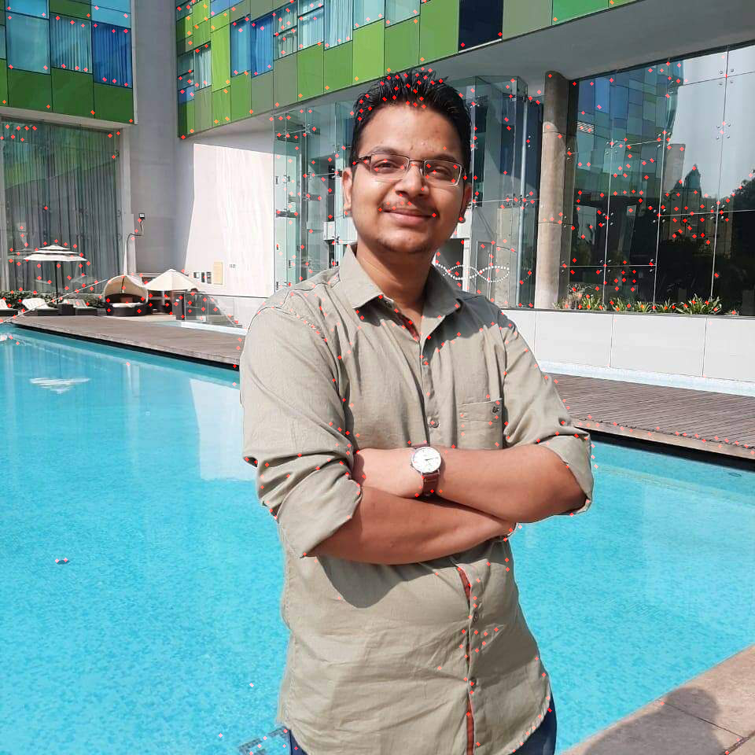

# 3D Reconstruction from accidental motion

## INSTALLATION

### Installing Dependencies for Ceres

#### CMake
    sudo apt-get install cmake
#### google-glog + gflags
    sudo apt-get install libgoogle-glog-dev libgflags-dev
#### BLAS & LAPACK
    sudo apt-get install libatlas-base-dev
#### Eigen3
    sudo apt-get install libeigen3-dev
#### SuiteSparse and CXSparse 
    sudo apt-get install libsuitesparse-dev

### Building Ceres Solver

    mkdir ceres-bin
    cd ceres-bin
    cmake ../ceres-solver/
    make -j4

### Installing Python Requirements

    pip3 install -r requirements.txt

### RUNNING  KLT

    cd src
    jupyter notebook reconstruct.ipynb 

### Running Reconstruction
    cd src
    jupyter notebook 3D Reconstruction from accidental motion.ipynb

#### Building DenseCRF package
- `chmod +x pydensecrf_setup.sh`
- `./pydensecrf_setup.sh` 

### Dataset

- [Download](https://umich.box.com/shared/static/bnqgx0an4v1b0ioq80sejb7rfiuku8iy.zip) the dataset & store in `datasets/`

- The custom dataset is already available in `datasets\`

### Results 

![Dense Map] (./output/cost_volume_100__(20, 20, 20)__depth_map.png)